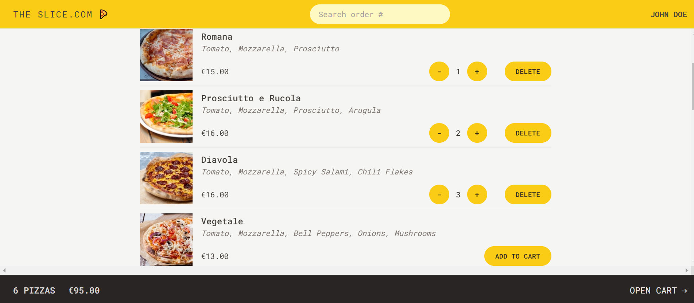

# The Slice.com: Pizza Ordering App.

### Description.

The Slice.com is a beautifully designed and responsive React.js pizza ordering app. With slice.com, enjoy a seamless pizza ordering experience. This responsive React.js app allows you to personalize your order by entering your name, selecting pizzas from the menu, and specifying the quantity.

### Functionalities.

Start by entering your name, then browse the pizza menu to select your favorite options. You can customize your order by choosing the pizza type and quantity, adding your address, and even prioritizing your order for an extra 20% charge. At any time, you can search for your order by ID and view the details of your delicious selection.
